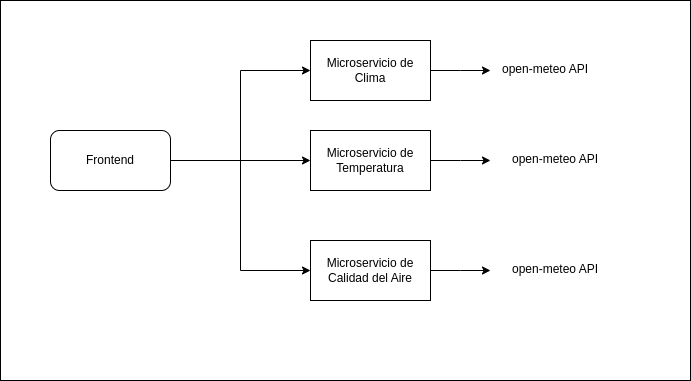
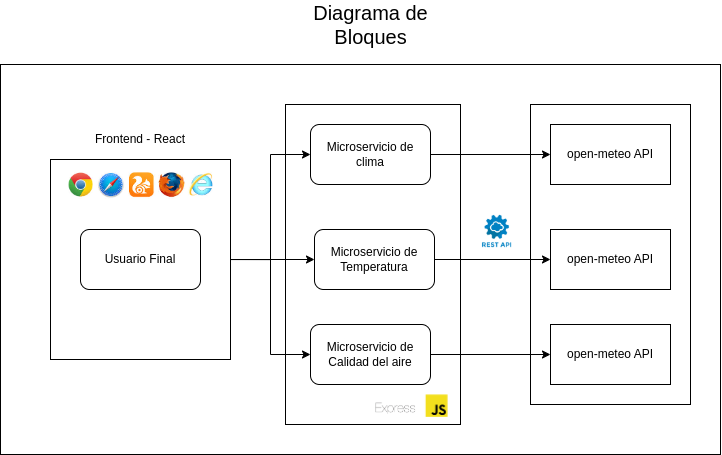
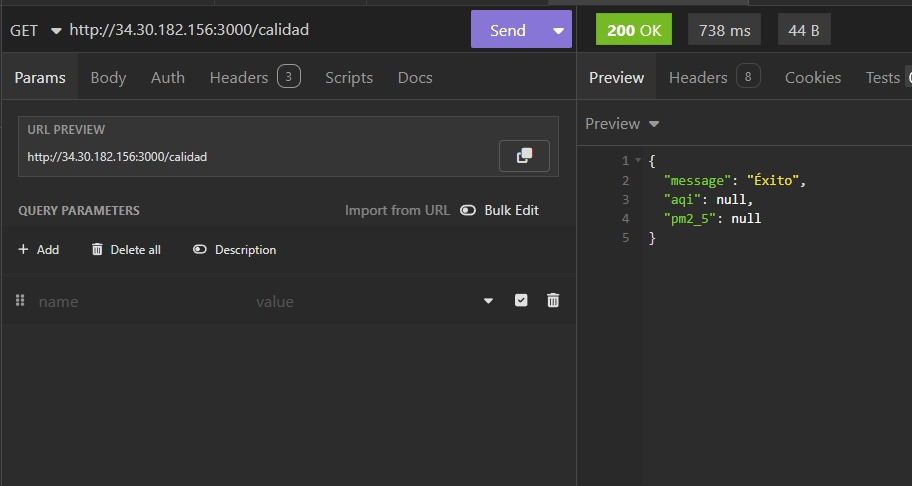
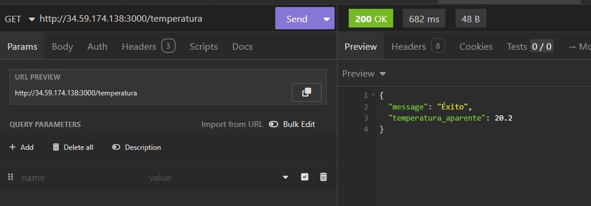
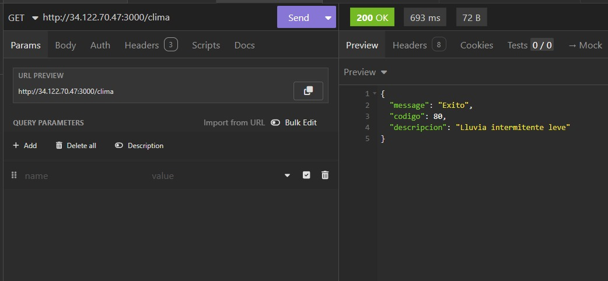

#### Universidad de San Carlos de Guatemala
#### Facultad de Ingeniería
#### Escuela de Ciencias y Sistemas
#### Análisis y diseño de sistemas 2
#### Inga. Ivonne Aldana
#### Auxiliar: Luis Angel Barrera Velásquez
#### Sección B
       

<strong> Práctica 2    
</strong>

       

| Nombre                              | Carnet    |
| :---:                               |  :----:   |
| Eduardo Alexander Reyes Gonzalez    | 202010904 |
| Pedro Martin Francisco              | 201700656 |
| Luis Antonio Cutzal Chalí           | 201700841 |
| Hugo Jorge Luis Pérez Arana         | 201504070 |
| Ingrid Lorena Garcia Yantuche       | 201700399 |

## Introducción

El cambio climático y la contaminación del aire son temas de creciente interés público y científico. Este proyecto nace con el propósito de ofrecer una plataforma web informativa, accesible a la ciudadanía, para visualizar en tiempo real datos climáticos y de calidad del aire de la Ciudad de Guatemala. La información es consumida desde APIs abiertas y procesada por una arquitectura moderna basada en microservicios.

Este proyecto surge con el objetivo de desarrollar una plataforma web informativa que permita a los usuarios visualizar, en tiempo real, datos clave sobre el estado del clima y el índice de calidad del aire (AQI) en la Ciudad de Guatemala.

La información presentada en la plataforma es obtenida desde APIs abiertas y confiables como las de open-meteo.com, lo que permite alimentar tres microservicios especializados: uno para datos climáticos generales, otro para la temperatura aparente y uno adicional para la calidad del aire. 

## Objetivos
### Objetivo general
Desarrollar una plataforma web informativa que muestre en tiempo real el clima, temperatura y la calidad del aire de la Ciudad de Guatemala, utilizando una arquitectura de microservicios desplegada en la nube.

### Objetivos específicos
- Implementar microservicios.
- Desplegar los servicios en Google Cloud Platform (GCP) con Terraform y Ansible.
- Reservar IPs públicas de forma estática para acceso continuo.

### Descripción

- Microservicio de Clima
  - Obtiene y procesa información meteorológica general.

- Microservicio de Temperatura
  - Gestiona los datos relacionados con la temperatura aparente.

- Microservicio de Calidad del Aire (AQI)
  - Proporciona las métricas del índice de calidad del aire.

## Tecnologias utilizadas
- **Backend**
  - **Node.js:** Entorno de ejecución para JavaScript en el servidor.
  - **Express:** Framework minimalista para la creación de APIs REST.

- **Frontend**
  - **React:** Biblioteca para la construcción de interfaces de usuario dinámicas y reactivas.

- **Contenedores**
  - **Docker:** Plataforma para contenedorización de microservicios, asegurando portabilidad y aislamiento.

- **Infraestructura como Código**
  - **Terraform:** Herramienta para la provisión de infraestructura en la nube mediante código declarativo.

- **Automatización de configuración**
  - **Ansible:** Herramienta de automatización para despliegue y configuración de servidores.

- **Pruebas de API**
  - **Postman:** Herramienta para realizar pruebas, documentación y monitoreo de endpoints de API.

- **Proveedor Cloud**
  - **Google Cloud Platform (GCP):** Plataforma en la nube donde se alojan los microservicios y el frontend.

## Diagrama de Arquitectura

La grafica muestra la arquitectura general del sistema, se implementó una arquitectura de capas con microservicios. Cada microservicio tendrá una responsabilidad específica:

- **Microservicio de clima: obtiene y procesa información meteorológica general.**
- **Microservicio de temperatura: gestiona los datos relacionados con la temperatura aparente**
- **Microservicio de calidad del aire: proporciona las métricas del índice de calidad del aire.**

Cada uno de estos microservicios consumirá datos en tiempo real desde las APIs gratuitas
ofrecidas por open-meteo.com.

## Diagrama de Bloques

## Pruebas

  - Uso de Postman para probar los endpoints REST.

#### 🔹 Endpoint: `http://3430128.156:3000/calidad`
- **Método:** `GET`
- **Descripción:** proporciona las métricas del índice de calidad del aire.
- **Respuesta esperada:**

#### 🔹 Endpoint: `http://34.59.174.138:3000/temperatura`
- **Método:** `GET`
- **Descripción:** Obtiene información relacionada a la temperatura.
- **Respuesta esperada:**

#### 🔹 Endpoint: `http://34.122.70.47:3000/clima`
- **Método:** `GET`
- **Descripción:** obtiene y procesa información meteorológica general.
- **Respuesta esperada:**

###  Link Postman

https://ayd2fase3.postman.co/workspace/AYD2_B_1S2025_PRAC2_G1~cc5a97f3-346f-49f2-a525-003ea3f09ab1/request/33099691-965c8547-d744-4d7d-978f-322445fef170?action=share&creator=33099691&ctx=documentation
